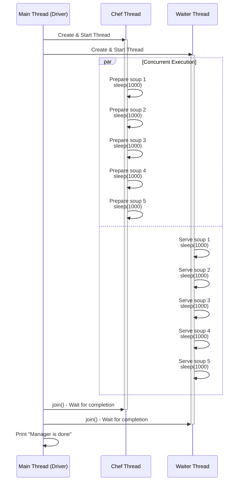

### Multi-Threading Sequence Diagram in Mermaid

To visualize the multi-threading example from the Java code (Chef preparing soup, Waiter serving soup, and the main Driver managing them), I've created a Mermaid sequence diagram. This shows the concurrent execution of the threads.

You can copy the following Mermaid code block into your Markdown (.md) file. GitHub will render it automatically as a diagram when you view the file.

### Explanation
- **Participants**: Main (Driver), Chef, and Waiter threads.
- **Flow**:
    - Main starts both threads.
    - The `par` block shows parallel (concurrent) execution of the loops in Chef and Waiter, with each step simulating work via `sleep(1000)`.
    - Main waits for both to finish using `join()`.
    - Finally, Main prints the completion message.
- This diagram highlights the concurrency: Chef and Waiter run simultaneously, unlike a single-threaded sequential flow.

Paste this into your MD file on GitHub, and it should render nicely. If you need adjustments (e.g., a different diagram type like a flowchart), let me know!