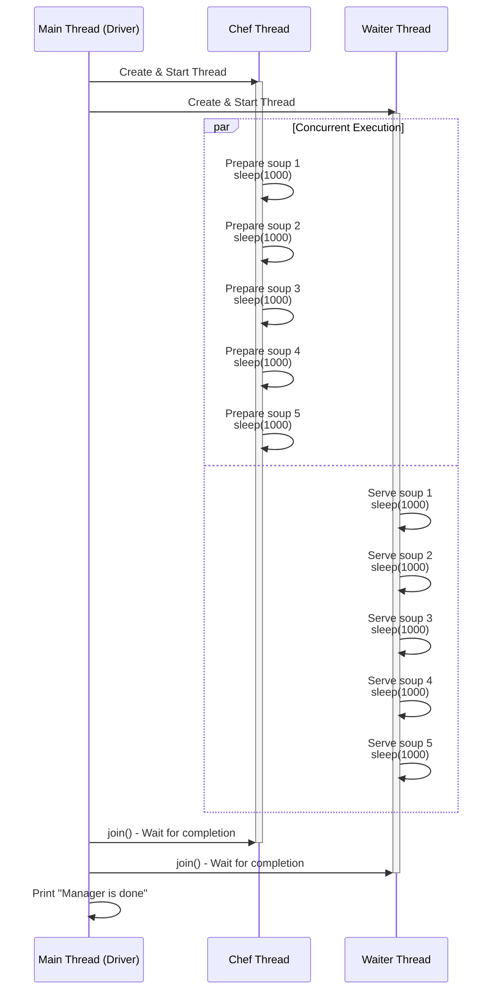

### Multi-Threading Sequence Diagram in Mermaid

### Explanation
- **Participants**: Main (Driver), Chef, and Waiter threads.
- **Flow**:
    - Main starts both threads.
    - The `par` block shows parallel (concurrent) execution of the loops in Chef and Waiter, with each step simulating work via `sleep(1000)`.
    - Main waits for both to finish using `join()`.
    - Finally, Main prints the completion message.
- This diagram highlights the concurrency: Chef and Waiter run simultaneously, unlike a single-threaded sequential flow.

### Note
- Kyun Order Change Hota Hai? 
- Thread Scheduling: Java (ya Python, jaisa maine simulate kiya) mein threads ko OS (operating system) manage karta hai. Scheduler decide karta hai ki kis thread ko kab CPU time mile. Yeh non-deterministic hota hai, matlab har run mein order alag ho sakta hai. 
- No Synchronization: Is code mein Chef aur Waiter ke loops independent hain—koi lock, wait, ya signal nahi hai jo ensure kare ki prepare hone ke baad hi serve ho. Toh, outputs interleave ho sakte hain jaise bhi scheduler chahe. 
- Sleep(1000): Yeh sirf simulate karne ke liye hai, lekin real mein bhi, agar ek thread thoda slow ho (jaise system load ki wajah se), dusra aage nikal sakta hai.