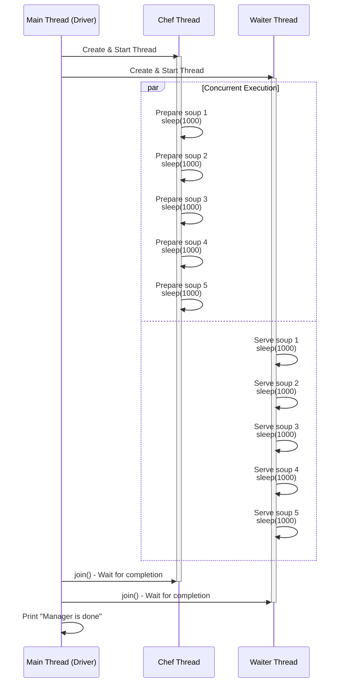
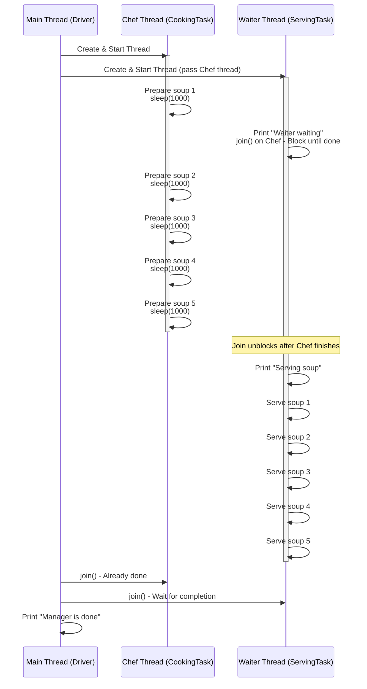

### Day 1: Basic Thread - Chef and Waiter Working Simultaneously

This is the introductory example of multi-threading in Java, where two tasks (chef preparing soup and waiter serving soup) run concurrently without any dependencies. The goal is to show how threads allow parallel execution, reducing total time compared to sequential (single-threaded) processing.

#### Key Concepts (from `day1.md`)
- **Multi-threading**: Enables multiple operations to run at once for better performance and responsiveness.
- **Real-world use**: Chat apps (type while receiving messages), servers (process data and handle requests in parallel), or any app keeping UI responsive during background tasks.
- **Critical skill**: Essential in modern apps for speed and user experience.

#### Code Summary
- `Chef.java`: Implements `Runnable`; prepares 5 soups with 1-second pauses.
- `Waiter.java`: Implements `Runnable`; serves 5 soups with 1-second pauses.
- `Driver.java`: Creates and starts two threads, then joins them so main waits for completion.

#### How It Works
- Threads run independently, so outputs interleave unpredictably due to OS scheduling.
- Total time: ~5 seconds (parallel), vs. 10 seconds sequentially.
- Order can change: Yes, as you noted, serving can sometimes print before preparing in the same step because there's no synchronization. This is normal in unsynchronized multi-threading—threads don't coordinate, so "serve soup 2" might appear before "prepare soup 2" in output, even though in reality, you'd want preparation first (which day2 addresses).

#### Sample Output (Variable Each Run)
```
day1.Chef is preparing soup 1
Waiter is serving soup 1
day1.Chef is preparing soup 2
Waiter is serving soup 2
day1.Chef is preparing soup 3
Waiter is serving soup 3
day1.Chef is preparing soup 4
Waiter is serving soup 4
day1.Chef is preparing soup 5
Waiter is serving soup 5
Manager is done, all staff are done
```
(But it could mix more, e.g., serve 3 before prepare 3.)

#### Sequence Diagram (Mermaid)
Copy this into your MD file for GitHub rendering:



This diagram shows parallel loops (using `par`), highlighting concurrency.

### Day 2: Waiter Waiting for Chef (Thread Coordination / Join)

This builds on day1 by adding coordination: The waiter waits for the chef to finish all preparations before serving. It uses `join()` for simple, efficient waiting, enforcing order.

#### Key Concepts (from `day2.md`)
- **Thread Coordination**: Ensures tasks follow a sequence to avoid errors from unordered execution.
- **Real-world use**: Photo editors (wait for load before edit), e-commerce (check inventory before purchase), finance (sequential batch processing).
- **Critical skill**: Prevents bugs like incomplete data or crashes in dependent tasks.

#### Code Summary
- `CookingTask.java`: Like day1's Chef; prepares 5 soups with 1-second pauses.
- `ServingTask.java`: Like day1's Waiter, but waits via `chefThread.join()` before serving (no pauses in serving). Implements the "ServingTask3" strategy (simple join); other strategies (polling, interrupting) are mentioned but not coded here.
- `Driver.java`: Starts threads, passes chef thread to waiter, and joins both for main to wait.

#### How It Works
- Chef starts preparing immediately.
- Waiter starts but blocks on `join()`, pausing until chef finishes.
- Once chef done (~5 seconds), waiter serves all soups instantly.
- Main waits for both via joins.
- Output order is fixed: All preparations, then all servings (no interleaving).
- No order chaos: Serving can't happen before preparation because of join().

#### Sample Output (Consistent Each Run)
```
Chef is preparing soup 1
Waiter is waiting for chef to prepare soup
Chef is preparing soup 2
Chef is preparing soup 3
Chef is preparing soup 4
Chef is preparing soup 5
Waiter is serving soup
Waiter is serving soup 1
Waiter is serving soup 2
Waiter is serving soup 3
Waiter is serving soup 4
Waiter is serving soup 5
Manager is done, all staff are done
```

#### Sequence Diagram (Mermaid)
Copy this into your MD file:



This diagram emphasizes the blocking wait (join) in Waiter, showing sequential dependency despite concurrent start.

These examples together show progression: Day1 for basic concurrency, Day2 for coordinated order. If you need code runs, modifications, or more diagrams, let me know!